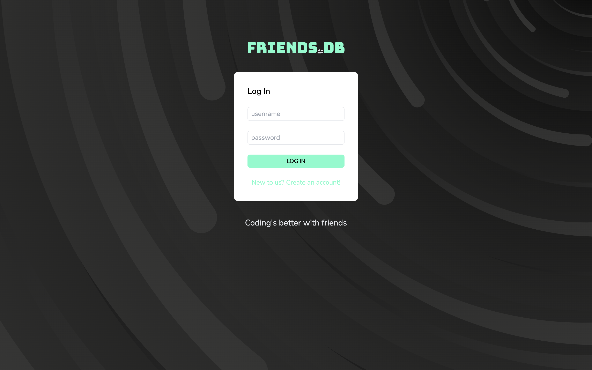
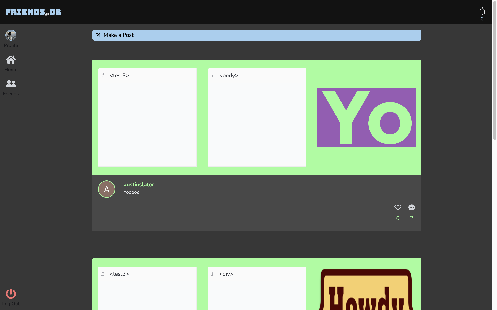
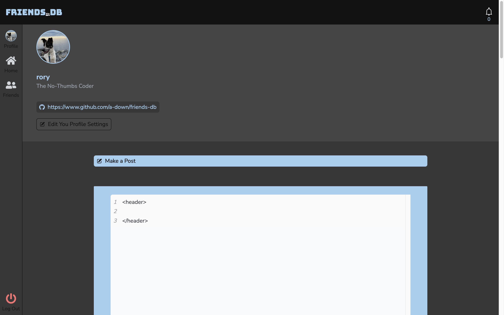
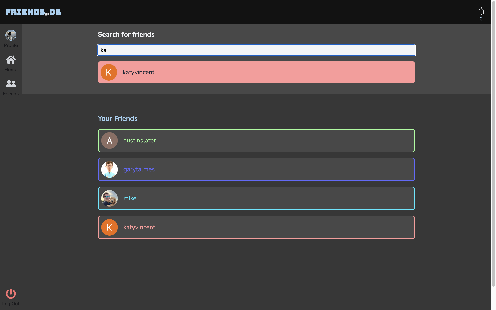

# Friends.db (Group Project #03)
Friends.db is a social network for coders that want a more intimite setting than Stack Overflow or Codepen. Friends.db allows you to follow your friends and see their posts. Only friends that follow you will see your posts, so you can show off even if it doesn't change the world! Friends.db was created by:

[Alec Downing](https://github.com/a-down)

[Johnaten Nguyen](https://github.com/JohnatenN81804)

[Wyatt Dronen](https://github.com/wyattdronen)

[Patrick Kevlahan](https://github.com/pkykev)

[Michael Engstrand](https://github.com/mikeengstrand)

[Lance Nguyen](https://github.com/Trouterwen)


## MVP
- user can signup and login to the site
- user can search for users by username ~~and send friend requests~~
- ~~users can approve friend requests they receive~~
- users can post either code blocks, images, or both along with a description within a post
- users will see their friends' posts in a main feed
- users can comment on their friend's posts and delete their comments
- users can like their friends' posts
- ~~on mobile, messaging is a full screen~~
- users can see a list of their own posts

## Features
User registration.
User login.
Integration with MongoDB for data storage.
React frontend with a responsive design.
npm Packages such as (react-toastify).
Friends and posts page.
profile customization.
Chats page. 
Comments and likes

## Usage
1. Visit Friends.db at [https://friendsdb-5ccabe7c6928.herokuapp.com/](https://friendsdb-5ccabe7c6928.herokuapp.com/)
2. Sign up for an account by providing:
    ```
    - username
    - password (with confirm)
    - an account color
    - a profile image
    ```
3. Click `SIGN UP` and you will be brought to the homepage. 
4. (Stop and notice that your chosen color is in multiple location on the page! This color will follow you on every page, unless you change it of course...)
5. Navigate to `Profile` with the nav
6. If you wish, use the `Update Profile Settings` section to add information or update your account settings.
7. Navigate to `Friends` to search for friends by username. You can navigate to their page and click `Follow Friend`.  Once you have followed a friend, they will appear on this page.
8. To make your first post, navigate either to the `Profile` or `Homepage` to make a post. Click `Make a Post` and enter up to 2 code snippets you'd like to share, as well as up to 2 images you'd like to share. Click `POST` to share with your friends!
9. When a friend likes or comments on your post, you will receive a notification! The `bell` icon in the upper right of the header will show how many notifications you have. If you have any, click the `bell` to display!
10. When you done using the site, use the `log out` button on the bottom of the page to log out. Don't worry, you will be able to `LOG IN` later using your username and password, so don't forget it!

## Visuals





## Project Structure
The `MERN` project is structured as follows:

```
root:

- client

- server

- package.json: Project dependencies and scripts.

- README.md
```
```
client: Contains the React frontend. 

- src: Source code for the React application.

- public: Public assets.
```
```
server: Contains the Node.js/Express.js backend.

- config: Configuration files.

- routes: API routes for authentication and other functionalities.

- models: MongoDB data models.

- controllers: Logic for handling routes.

- middleware: Custom middleware functions.
```

## Other Links 

Deployed Site: [friendsdb-5ccabe7c6928.herokuapp.com/](https://friendsdb-5ccabe7c6928.herokuapp.com/)

Repository: [github.com/a-down/friends-db](https://github.com/a-down/friends-db)

Presentation: [https://docs.google.com/presentation/d/1FTh_yXOopaWuFvzIlaTcE_NnsZg0GfDs0Fx_HDCRirQ/edit#slide=id.gcb9a0b074_1_0](https://docs.google.com/presentation/d/1FTh_yXOopaWuFvzIlaTcE_NnsZg0GfDs0Fx_HDCRirQ/edit#slide=id.gcb9a0b074_1_0)


