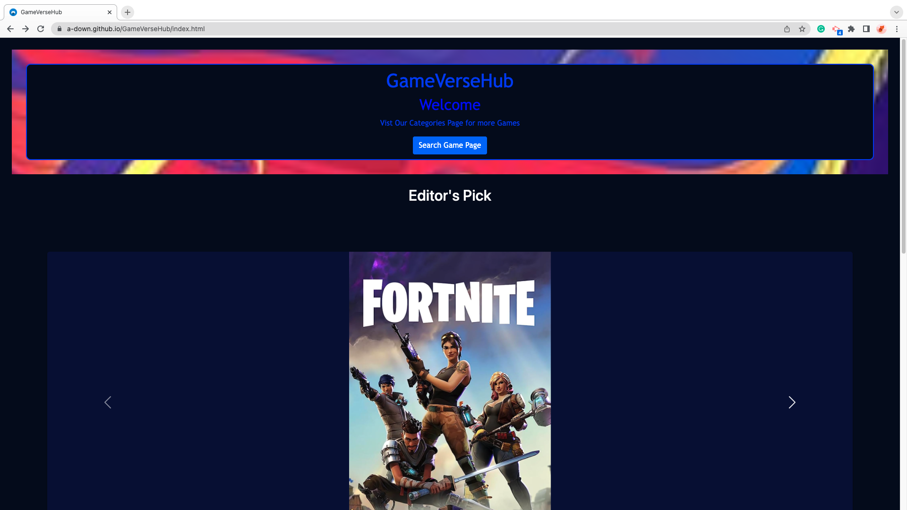
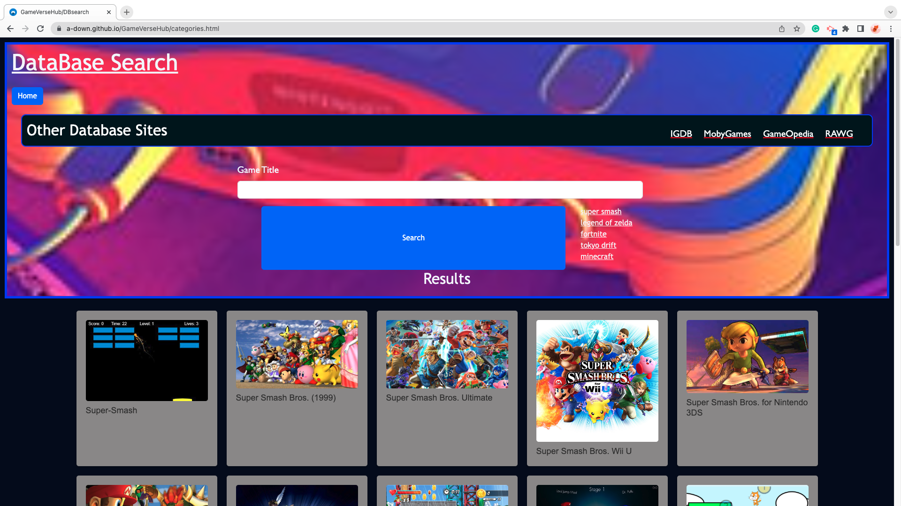

# GameVerseHub (Group Project 01)

The goal was to create a web application with the subject chosed by the group. Below is how we met the project criteria:

## Project Requirements

  ### Minimal Viable Product
    - The user will be presented with a landing page.
    - The user be able to visit a search page.
    - The user sees a search form to search for games.
    - The search page updates dynamically according to the search.
    - When the user hovers/clicks on the game card, more information becomes available.

  ### User Form
    The user utilizes a form to search the database of video games. They enter the title of the game they want to search for in the input field, and then they use the submit button to initiate the search.

  ### Local Storage
    We store previous searches of the user in local storage. If the user visits the page with previous searches, a link is displayed to print their previous 5 searches on the page. The user can click on these links to search the query again.

  ### API
    Our landing page has cards that dynamically present the 6 most pouplar games according to the RAWG API. Day.js is utilized to show that the game titles generated are current as of the current date.

  ### New Technology or Library
    We are using the RAWG API to display video game titles, images, and descriptions. 
    
    On the landing page, RAWG dynamically presents the 6 most popular game titles as of the current date. 
      
    On the search page, users can search for video games by title using the RAWG API. Clicking on a search result calls the game's description from RAWG.

## Team Members
    - Henrich Michlitsch (Henrichm77)
    - Johnaton Nguyen (JohnatenN81804)
    - Lance Nguyen (Trouterwen)
    - Yaya Nur (yamyam500)
    - Alec Downing (a-down)

## Visual Example

## Working Version

[Link to Deployed Version](https://a-down.github.io/GameVerseHub/)

## Resources

### Icon Sources
---
  [Close icons created by Nendra Wahyu - Flaticon](https://www.flaticon.com/free-icons/close)

  

  ---
  [Favicon icon created by Max Pixels](https://www.maxpixel.net/Video-Games-Icon-Gamepad-Controller-Computer-Game-1784573)

  

### API Sources
---
  [RAWG Video Games Databse API](https://rawg.io/apidocs)

  [Day.js API](https://day.js.org/)

### Image Sources
--- 
  [Tears of the Kingdom Carousel Image Source](https://images.nintendolife.com/880243a8baed2/switch-tloz-totk-artwork-01.large.jpg)

  [Rocket League Image Source](https://en.wikipedia.org/wiki/File:Rocket_League_coverart.jpg)

  [Hypnospace Outlaw Image Source](https://assets-prd.ignimgs.com/2020/10/01/hypnospace-outlaw-button-1601573797463.jpg)

  [Legend of Dragoon Image Source](https://www.ign.com/games/the-legend-of-dragoon)
  
  [Fortnite Image Source](https://m.media-amazon.com/images/M/MV5BNzU2YTY2OTgtZGZjZi00MTAyLThlYjUtMWM5ZmYzOGEyOWJhXkEyXkFqcGdeQXVyNTgyNTA4MjM@._V1_FMjpg_UX1000_.jpg)
